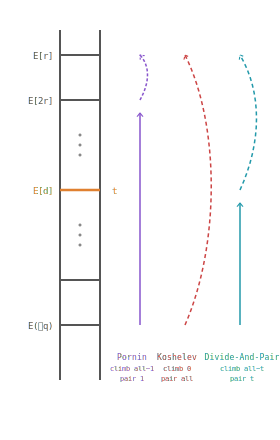

# Divide-and-Pair: Faster subgroup membership testing for elliptic curves

[](LICENSE) [](https://goreportcard.com/report/github.com/yelhousni/divide-and-pair) [](https://pkg.go.dev/github.com/yelhousni/divide-and-pair)

<p align="center">
  <picture>
    <source media="(prefers-color-scheme: dark)" srcset="ladder-dark.svg">
    
  </picture>
</p>

Companion code for the article *"Divide-and-Pair: Faster subgroup membership testing for elliptic curves"* by Y. Dai, Y. El Housni, D. Koshelev and K. Reijnders.

## Code structure

Each curve lives in its own package:

- `curve25519/`
- `jubjub/`
- `fourq/`
- `curve448/`
- `gc256a/`
- `crrl/` submodule with the original Rust Ed25519/Curve25519 cross-check

Inside each package:

- `curve.go` and `point.go` implement curve arithmetic.
- `subgroup_membership.go` implements the subgroup membership tests from the paper.
- `subgroup_membership_test.go` contains correctness tests and the benchmarks used for the paper-style comparisons.
- `fp/` or `fp2/` contains the field arithmetic and residuosity helpers used by the subgroup tests.

## Paper-to-code map

### Curve25519

- Naive baseline: `curve25519/subgroup_membership.go`, `(*PointAffine).isInSubGroupNaive`
- Pornin method: `curve25519/subgroup_membership.go`, `(*PointAffine).isInSubGroupPornin`
- Divide-and-pair quartic test via Weilert GCD: `curve25519/subgroup_membership.go`, `(*PointAffine).isInSubGroupQuartic`
- Divide-and-pair quartic test via exponentiation: `curve25519/subgroup_membership.go`, `(*PointAffine).isInSubGroupQuarticExp`
- Quartic symbol implementations: `curve25519/fp/quartic_symbol.go`
- Main tests reproducing the comparison:
  - `TestSubgroupMembership`
  - `TestSubgroupAgreement`
  - `TestQuarticSymbolFromSubgroup`
  - `BenchmarkIsInSubGroupNaive`
  - `BenchmarkIsInSubGroupPornin`
  - `BenchmarkIsInSubGroupQuartic`
  - `BenchmarkIsInSubGroupQuarticExp`

### Jubjub

- Naive baseline: `jubjub/subgroup_membership.go`, `(*PointAffine).isInSubGroupNaive`
- Pornin method: `jubjub/subgroup_membership.go`, `(*PointAffine).isInSubGroupPornin`
- Divide-and-pair octic method: `jubjub/subgroup_membership.go`, `(*PointAffine).isInSubGroupOcticExp`
- Main tests reproducing the comparison:
  - `TestSubgroupMembership`
  - `TestSubgroupAgreement`
  - `BenchmarkIsInSubGroupNaive`
  - `BenchmarkIsInSubGroupPornin`
  - `BenchmarkIsInSubGroupOcticExp`

### FourQ

- Naive baseline: `fourq/subgroup_membership.go`, `(*PointAffine).isInSubGroupNaive`
- Endomorphism-based test: `fourq/endomorphisms.go`, `(*PointAffine).isInSubGroupEndo`
- Divide-and-pair Tate method: `fourq/subgroup_membership.go`, `(*PointAffine).isInSubGroupTate`
- Main tests reproducing the comparison:
  - `TestSubgroupMembership`
  - `TestSubgroupAgreement`
  - `BenchmarkIsInSubGroupNaive`
  - `BenchmarkIsInSubGroupTate`
  - `BenchmarkIsInSubGroupEndo`

### Curve448

- Naive baseline: `curve448/subgroup_membership.go`, `(*PointAffine).isInSubGroupNaive`
- Pornin method: `curve448/subgroup_membership.go`, `(*PointAffine).isInSubGroupPornin`
- Divide-and-pair quartic-over-`Fp2` method: `curve448/subgroup_membership.go`, `(*PointAffine).isInSubGroupQuartic`
- Main tests reproducing the comparison:
  - `TestSubgroupMembership`
  - `TestSubgroupAgreement`
  - `BenchmarkIsInSubGroupNaive`
  - `BenchmarkIsInSubGroupPornin`
  - `BenchmarkIsInSubGroupQuartic`

### GC256A

- Naive baseline: `gc256a/subgroup_membership.go`, `(*PointAffine).isInSubGroupNaive`
- Pornin method: `gc256a/subgroup_membership.go`, `(*PointAffine).isInSubGroupPornin`
- Divide-and-pair quartic-over-`Fp2` method: `gc256a/subgroup_membership.go`, `(*PointAffine).isInSubGroupQuartic`
- Main tests reproducing the comparison:
  - `TestSubgroupMembership`
  - `TestSubgroupAgreement`
  - `BenchmarkIsInSubGroupNaive`
  - `BenchmarkIsInSubGroupPornin`
  - `BenchmarkIsInSubGroupQuartic`

### Rust `crrl` cross-check

- `crrl/` is a git submodule pointing to a fork of `crrl`
- It implements the Curve25519/Ed25519 `QuarticExp` subgroup-membership method
- Main Rust code path: `crrl/src/ed25519.rs`, `Point::is_in_subgroup_quartic_exp`
- Main Rust benchmark file: `crrl/benches/ed25519.rs`

## Test and benchmark

You need:

- [Go](https://go.dev/doc/install) (tested with `1.25.7` and `1.26.0`)
- for the `crrl/` comparison: `git` with submodule support and a Rust toolchain with `cargo`

Run all tests:

```bash
go test ./...
```

Run the subgroup-membership benchmarks used for method comparisons:

```bash
go test -run '^$' -bench IsInSubGroup -benchmem ./curve25519 ./jubjub ./fourq ./curve448 ./gc256a
```

Initialize the Rust submodule and run the Ed25519 cross-check:

```bash
git submodule update --init crrl
cargo test --manifest-path crrl/Cargo.toml --features ed25519 ed25519::tests::in_subgroup
cargo bench --manifest-path crrl/Cargo.toml --bench ed25519 --features ed25519
```

## References

- Pornin, [*Point-halving and subgroup membership in twisted Edwards curves*](https://eprint.iacr.org/2022/1164), 2022.
- Koshelev, [*Subgroup membership testing on elliptic curves via the Tate pairing*](https://eprint.iacr.org/2022/037), 2022.
- Costello and Longa, [*FourQ: four-dimensional decompositions on a Q-curve over the Mersenne prime*](https://eprint.iacr.org/2015/565), ASIACRYPT 2015.
- Weilert, [*Fast Computation of the Biquadratic Residue Symbol*](https://doi.org/10.1006/jnth.2002.2783), Journal of Number Theory, 2002.
- Montgomery, [*Evaluating recurrences of form Xm+n = f(Xm, Xn, Xm-n) via Lucas chains*](https://cr.yp.to/bib/1992/montgomery-lucas.pdf), 1992.
- [RFC 8032](https://www.rfc-editor.org/rfc/rfc8032), Edwards-Curve Digital Signature Algorithm (EdDSA).
- [RFC 7836](https://www.rfc-editor.org/rfc/rfc7836), GC256A and GOST R 34.10-2012.

-------------------------------
<p align="center">
  <picture>
    
  </picture>
</p>


